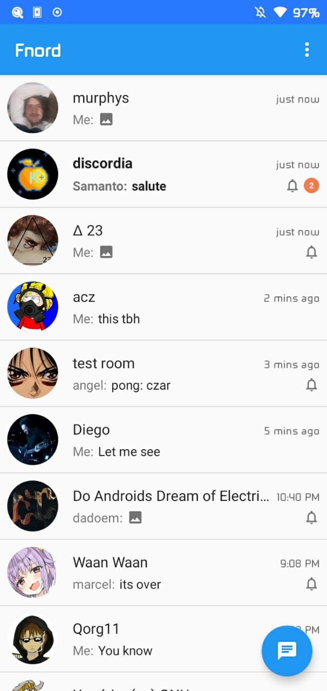
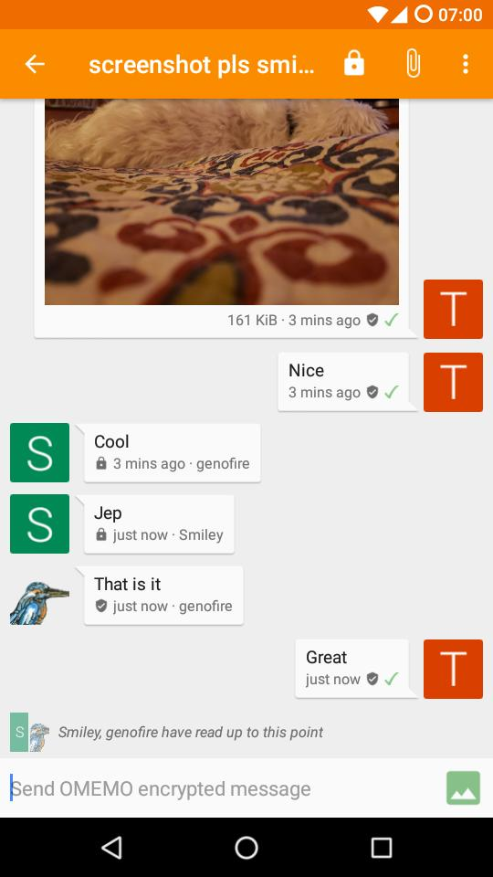
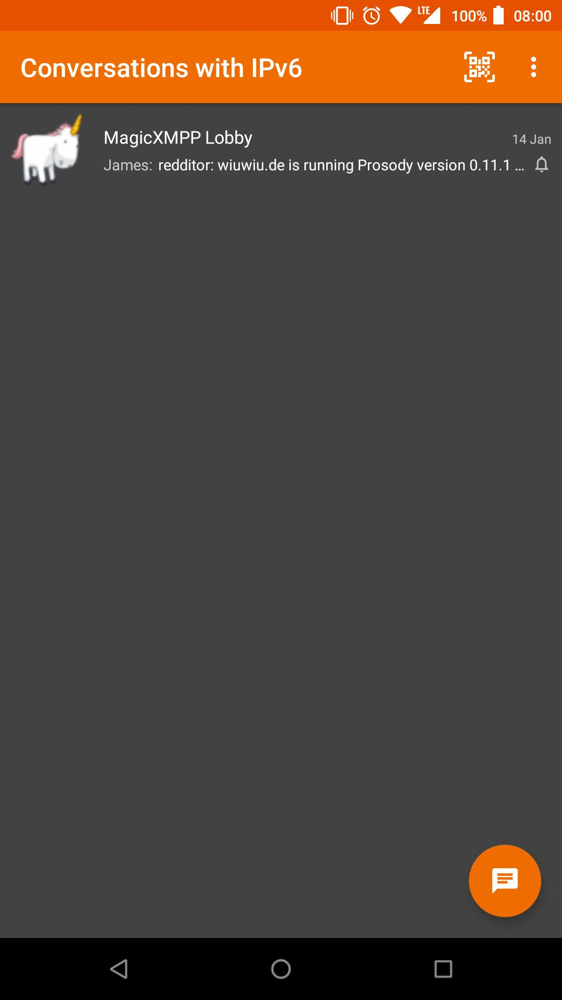
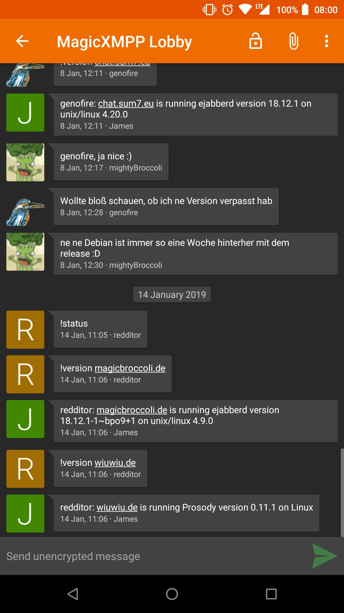
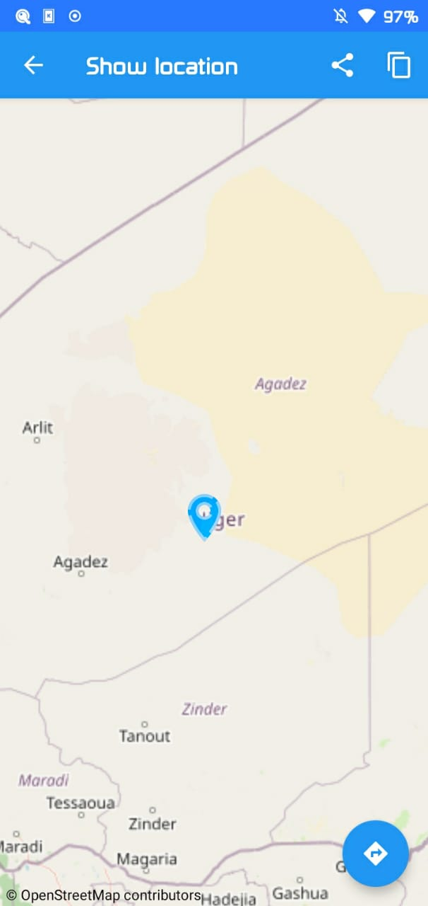

<h1 align="center">Fnord is a fork of <a href="https://github.com/iNPUTmice/Conversations">Conversations</a></h1>

A Jabber/XMPP chat client which is fair to the eyes

  
  

  
  
  
  
  

## Changes to origin:
* add a lot of UI enhancements.
* rebrands it as st.kalli.conversations (to run both version together)

## Features

* End-to-end encryption with [OMEMO](http://conversations.im/omemo/) or [OpenPGP](http://openpgp.org/about/)
* Send and receive images as well as other kind of files
* [Encrypted audio and video calls (DTLS-SRTP)](https://help.conversations.im)
* Share your location
* Send voice messages
* Indication when your contact has read your message
* Intuitive UI that follows Android Design guidelines
* Pictures / Avatars for your Contacts
* Synchronizes with desktop client
* Conferences (with support for bookmarks)
* Address book integration
* Multiple accounts / unified inbox
* Very low impact on battery life

### XMPP Features

Conversations works with every XMPP server out there. However XMPP is an
extensible protocol. These extensions are standardized as well in so called
XEP's. Conversations supports a couple of these to make the overall user
experience better. There is a chance that your current XMPP server does not
support these extensions; therefore to get the most out of Conversations you
should consider either switching to an XMPP server that does or — even better —
run your own XMPP server for you and your friends. These XEP's are:

* [XEP-0065: SOCKS5 Bytestreams](http://xmpp.org/extensions/xep-0065.html) (or mod_proxy65). Will be used to transfer
  files if both parties are behind a firewall (NAT).
* [XEP-0163: Personal Eventing Protocol](http://xmpp.org/extensions/xep-0163.html) for avatars and OMEMO.
* [XEP-0191: Blocking command](http://xmpp.org/extensions/xep-0191.html) lets you blacklist spammers or block contacts
  without removing them from your roster.
* [XEP-0198: Stream Management](http://xmpp.org/extensions/xep-0198.html) allows XMPP to survive small network outages and
  changes of the underlying TCP connection.
* [XEP-0280: Message Carbons](http://xmpp.org/extensions/xep-0280.html) which automatically syncs the messages you send to
  your desktop client and thus allows you to switch seamlessly from your mobile
  client to your desktop client and back within one conversation.
* [XEP-0237: Roster Versioning](http://xmpp.org/extensions/xep-0237.html) mainly to save bandwidth on poor mobile connections
* [XEP-0313: Message Archive Management](http://xmpp.org/extensions/xep-0313.html) synchronize message history with the
  server. Catch up with messages that were sent while Conversations was
  offline.
* [XEP-0352: Client State Indication](http://xmpp.org/extensions/xep-0352.html) lets the server know whether or not
  Conversations is in the background. Allows the server to save bandwidth by
  withholding unimportant packages.
* [XEP-0363: HTTP File Upload](http://xmpp.org/extensions/xep-0363.html) allows you to share files in conferences
  and with offline contacts.

